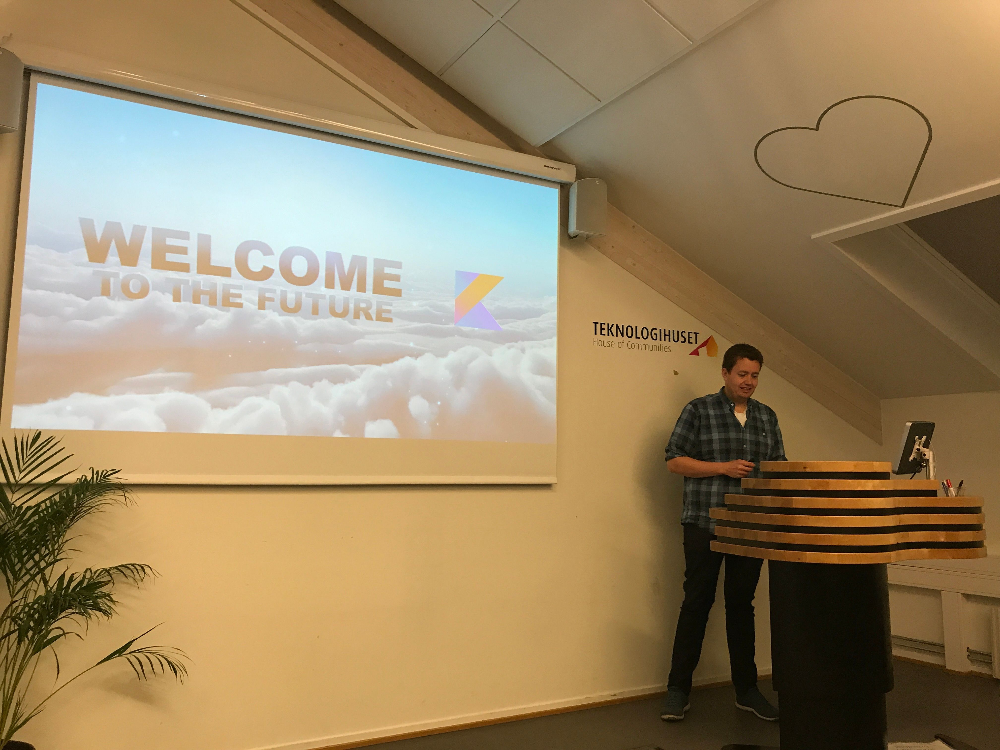
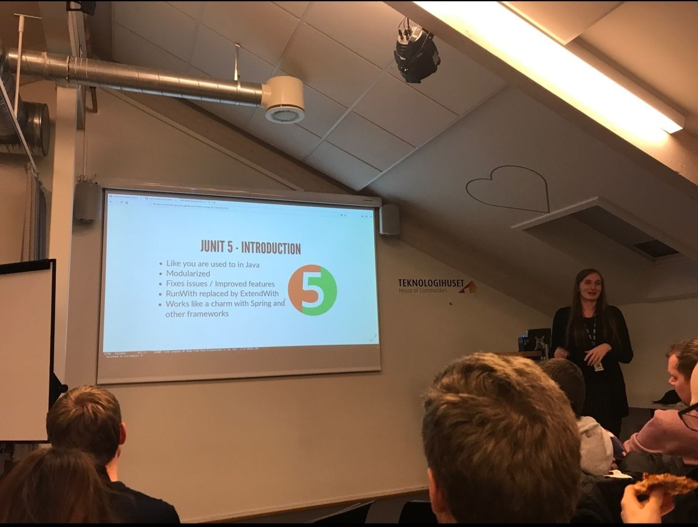
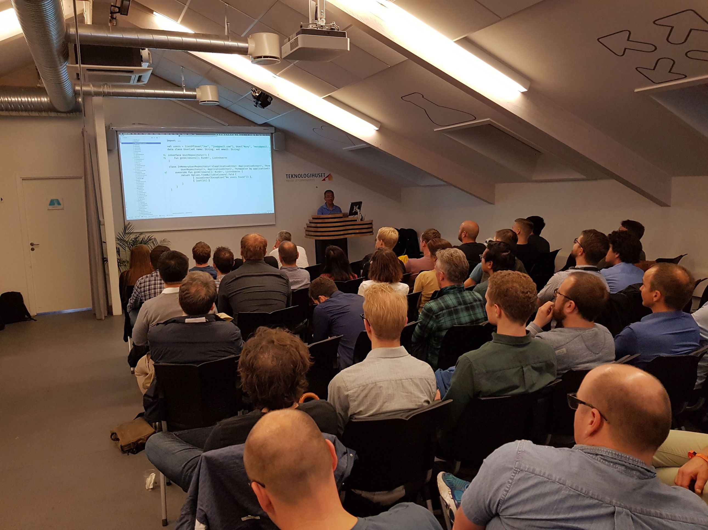
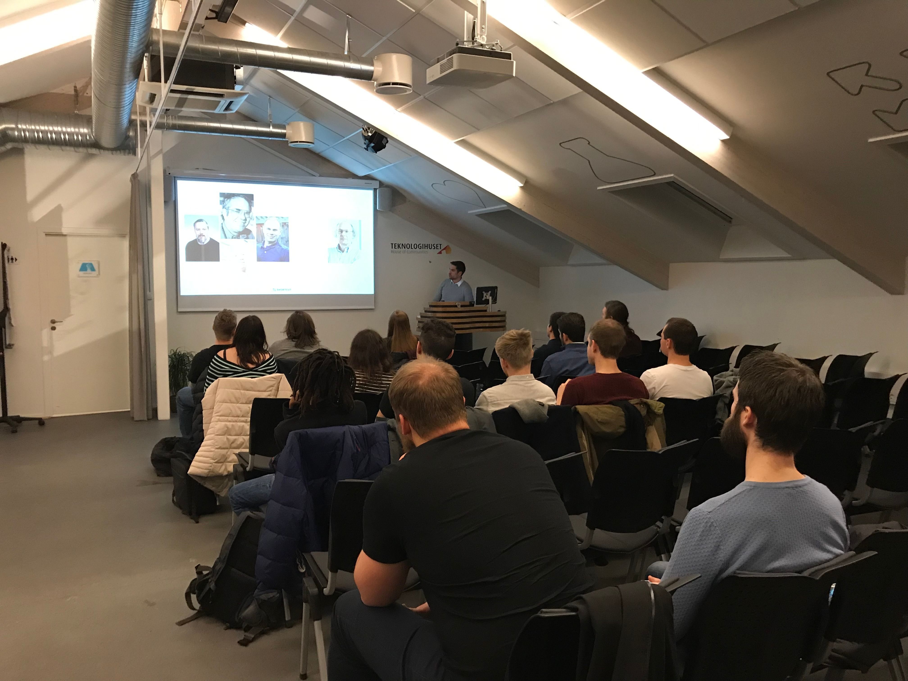

---?image=assets/img/kotlin-logo2.png&size=cover

---?image=assets/img/kart1.png&size=75% auto

---?image=assets/img/kart2.png&size=75% auto

----?video=https://video.twimg.com/tweet_video/DyUYJpkXQAAoWnE.mp4&loop=true&muted=true

---
@snap[north span-100]
### Funksjonelt / objekt-orientert?
@snapend
**`f(o)`**
 
**`o.f()`**

---
@snap[north span-100]
### Eksempel
@snapend

1. [MockWebServer](https://github.com/square/okhttp/tree/master/mockwebserver#example)
2. [Kotlin-ifisert](https://github.com/Skatteetaten/gobo/blob/master/src/test/kotlin/no/skatteetaten/aurora/gobo/integration/mockWebServer.kt)
  * Extension function
  * Null safety
  * Range
  * Default argument

---
@snap[span-100]
### Hvorfor Kotlin?
@snapend

---?image=assets/img/most-loved.jpg&size=contain

@snap[south text-black span-100]
**Stack overflow survey 2018**
@snapend

---?image=assets/img/hvorfor-kotlin.jpg&size=contain

---

@snap[span-100]
### Hva brukes Kotlin til?
@snapend

---
@snap[north span-100]
### Kotlin i Systek
@snapend

@snap[west logos technipfmc]

@snapend

@snap[midpoint logos nrk]

@snapend

@snap[east logos skatteetaten]

@snapend

---
@snap[span-100]
### Oslo Kotlin meetup
@snapend

---

@snap[north-west meetup]

@snapend

@snap[north-east meetup]

@snapend

@snap[south-west meetup]

@snapend

@snap[south-east meetup]

@snapend

---

<iframe class="stretch" data-src="https://www.meetup.com/meetup-group-nWeRbyMu/"></iframe>

---
@snap[span-100]
### Referanser
@snapend

* [FP vs OO](https://blog.cleancoder.com/uncle-bob/2018/04/13/FPvsOO.html)
* [Object Oriented Programming vs. Functional Programming](https://www.codenewbie.org/blogs/object-oriented-programming-vs-functional-programming)

